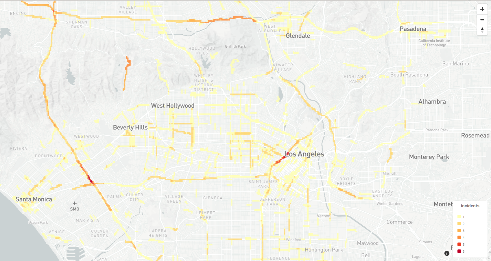

# waze-predict
## Predictive modeling for City of LA's waze data

First download local climatological data at https://www.ncdc.noaa.gov/cdo-web/datasets

Save it as `weather_data.csv` in the data folder.

Then run `road_squares.py`. It uses `la_streets.csv` to generate a grid covering all streets in LA County in  `data/`. This grid is used as the base to generate training data or to bucket the data.

Note the code that actually turns a path (aka geojson linestring) into a set of polygons is in `cover_path.py`. This also contains options that can be used to configure grid generation.

Usage: `python road_squares.py`

Next, use `pull_data.py` to pull data from the database into usable csvs (into `data/jams.csv`, specifically).

Usage: `python pull_data.py user password database -H host -p port`

Currently, it pulls from `jams2`, which is only a small subset of the entire table. This can be changed very easily in the source code. 

------------

Initial visualizations can be done with `hotspots.py` and `geojsons/make_html.ipynb`. First, run `hotspots.py` (`python hotspots.py`) to aggregate the jams by time and location. It outputs hourly geojson files in the `geojsons/` folder. 

I choose to aggregate by day of the week and hour. I combined all the weekdays, so the geojsons are `weekday-0` (aka midnight to 1 am on a weekday) through `weekday-23` (11 pm to midnight on a weekday), `saturday-0` through `saturday-23` and `sunday-0` through `sunday-23`.

Finally, use `geojsons/make_html.ipynb` to create html visualizations of the files. For example, here is 2 pm on a weekday:

The darker the color, the more incidents were reported. We can see that the 405 near Pico was jammed on 6 different occasions on weekdays at 2 pm. In the future I would like to combine these seperate files into one html that allows us to slide between different times to see traffic conditions change. 

